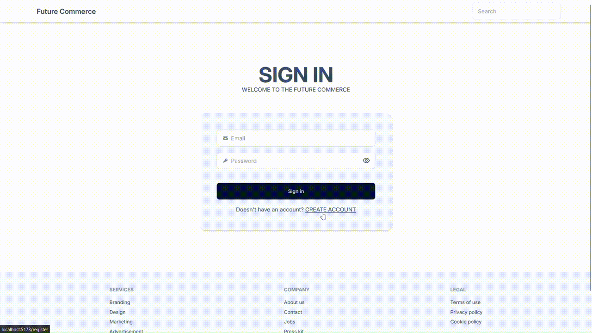
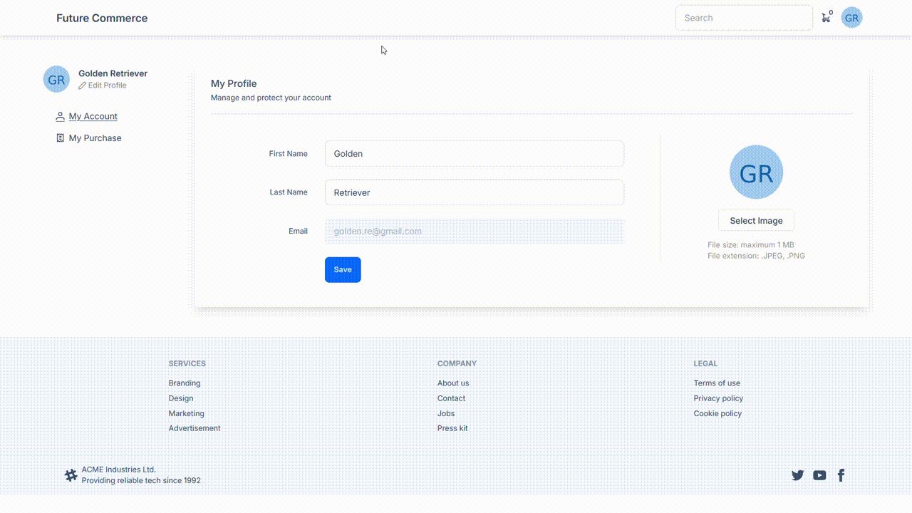
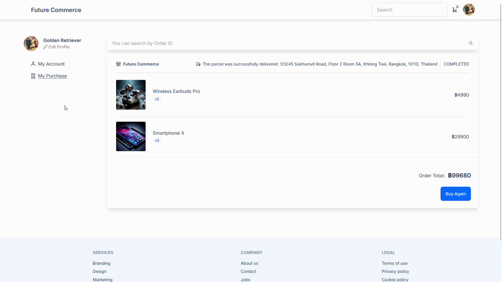
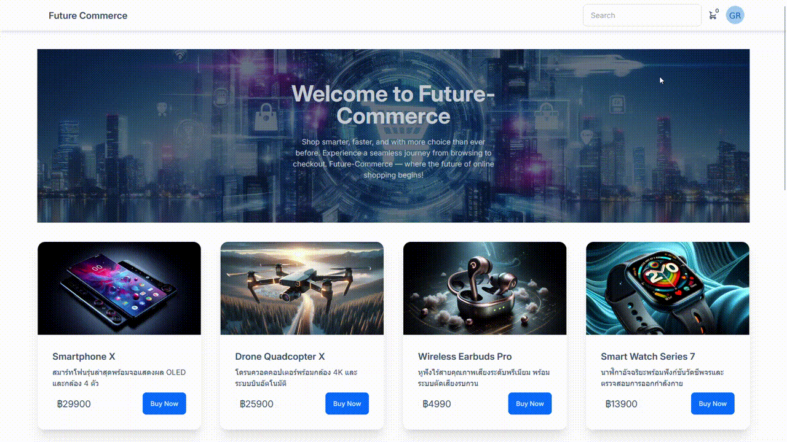
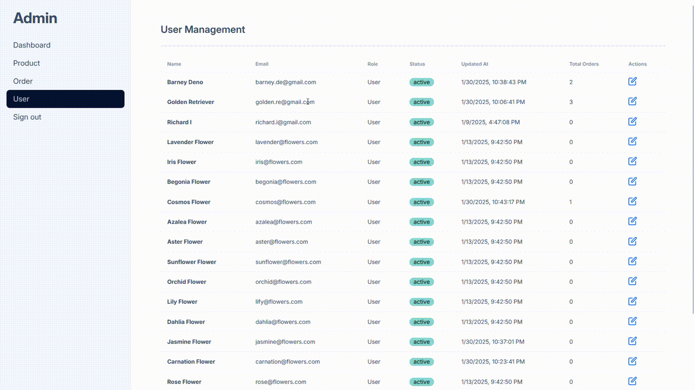

# Future Commerce

This is a simple e-commerce website that I created to practice frontend, backend, database development, and the integration of these components.

## Features

- Home page includes navigation bar, search bar, cart icon and user profile picture.
- Search for products.
- Sign in and Sign up.
- Add products to the cart, update quantities, proceed to checkout, view and print receipts.
- Update profile details including first name, last name, and profile picture.
- View order history and reorder directly from past orders.
- Search for purchase history.
- Logout.

## Manual

### User Role

#### Homepage

#### Sign in and Sign up Page

#### Cart and Checkout Page

#### User Profile Page

#### Purchase History Page

#### Logout

### Admin Role

#### Dashboard Page

#### Product Management Page

#### Order Management Page

#### User Management Page

## Tech Stack

- Vue.js
- Tailwind CSS
- DaisyUI
- Express.js
- PostgreSQL
